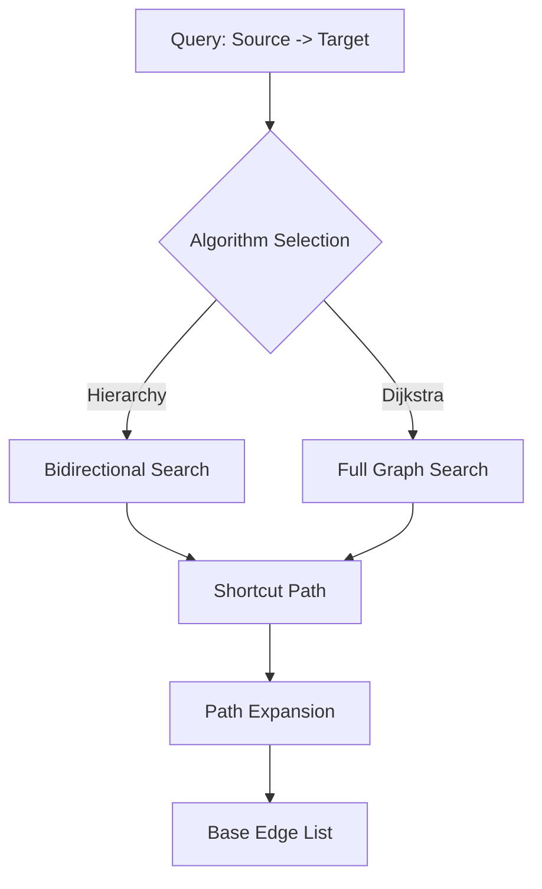

# Routing Algorithms

The H3 Routing Platform supports multiple routing algorithms, ranging from high-performance optimized searches to exact ground-truth pathfinding.

## 1. H3 Spatial Hierarchy

Instead of classic node-rank based Contraction Hierarchies, this platform implements an **H3 Spatial Hierarchy**. This approach leverages the hexagonal geographic grid to organize shortcuts and prune the search space.

### Core Mechanism:
- **Resolution-Based Levels**: The hierarchy uses H3 resolutions (typically 15 down to 0) as levels. Lower resolutions (larger hexagons) represent higher levels in the hierarchy.
- **Spatial Shortcuts**: During the offline phase, shortcuts are generated between base road edges. Each shortcut is associated with its **Lowest Common Ancestor (LCA)** H3 cell—the smallest hexagon that contains both the source and destination.
- **Hierarchy Cones**: 
    - **Upward Edges** (`inside = 1`): Edges that lead into a higher-level (lower resolution) H3 cell.
    - **Downward Edges** (`inside = -1`): Edges that exit a higher-level cell into a lower-level one.
- **Search Space**: At query time, the bidirectional search only explores "upward" edges from the source and "downward" edges toward the destination, drastically reducing the number of edges visited.

### Theoretical Basis: Tree Decomposition
The H3 Spatial Hierarchy is a practical implementation of **Tree Decomposition for Line Graphs**. In this model:
- **Line Graph**: The routing graph is treated as a "line graph" where road segments (edges) are the primary nodes of interest.
- **Hexagonal Separators**: H3 hexagons at various resolutions act as "bags" in the tree decomposition. 
- **Balanced Partitioning**: The hierarchical grid ensures a balanced decomposition, keeping the treewidth manageable and enabling sub-millisecond query times even on very large networks.

## 2. Bidirectional Hierarchy Algorithm

For both standard searches and hierarchy queries, we use a **Bidirectional Hierarchy Algorithm** implementation.

- **Forward Search**: Explores outgoing edges from the source, following only upward or internal shortcuts.
- **Backward Search**: Explores incoming edges from the target, following only downward or internal shortcuts.
- **Meeting Point**: The algorithm terminates when the two search frontiers meet, significantly reducing the number of nodes visited compared to a unidirectional search.

## 3. Dijkstra Mode (Ground Truth)

A recent addition is the **Dijkstra Mode**, which provides an exact shortest path ground-truth by searching the entire shortcut graph without hierarchy constraints.

- **Purpose**: Used for verifying the accuracy of pre-calculated shortcuts.
- **Behavior**: Ignores H3 levels and hierarchy rules, treating the graph as a single flat network.
- **Performance**: Usually **35-40x slower** than the Hierarchy search but serves as a "Gold Standard" for correctness.

## 4. H3 Spatial Pruning

The "Pruned" search mode leverages the H3 grid to further restrict the search volume based on the geometry of the request.

- **High Cell Calculation**: We identify the Highest Common Ancestor (LCA) H3 cell that contains both start and end points.
- **Search Pruning**: Any node or edge that falls outside the boundary of this "High Cell" (plus a safety buffer of immediate neighbors) is pruned from the search.
- **Result**: Even lower query latency for both short and long-distance routes by preventing the search from expanding into irrelevant geographic areas.

---

