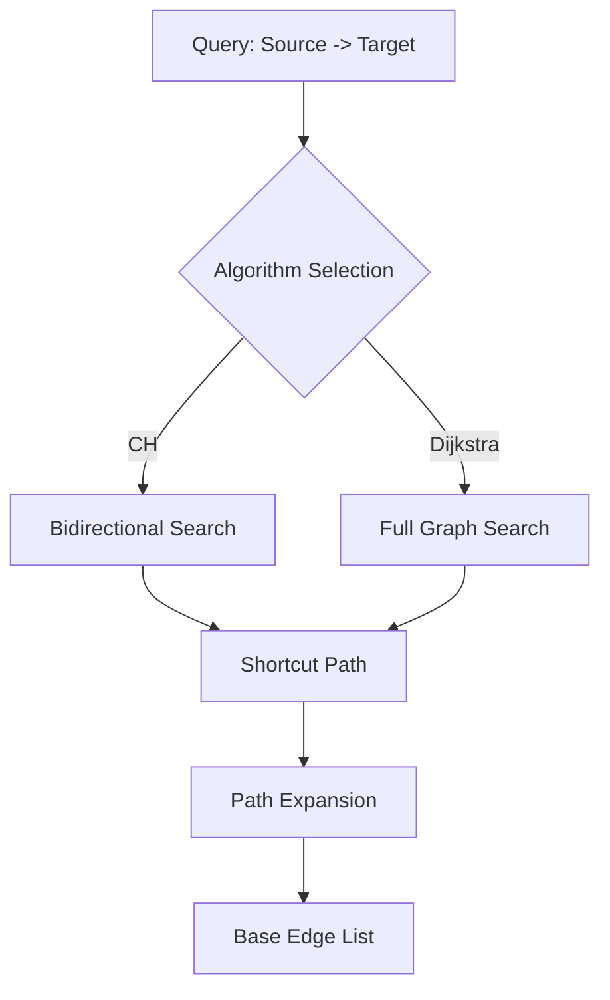

# Routing Algorithms

The H3 Routing Platform supports multiple routing algorithms, ranging from high-performance optimized searches to exact ground-truth pathfinding.

## 1. Contraction Hierarchies (CH)

The primary routing method uses **Contraction Hierarchies**. This approach involves an offline "preprocessing" phase where the road network is augmented with **shortcut edges**.

### Core Mechanism:
- **Node Ordering**: Nodes are ranked by importance.
- **Node Contraction**: When a node is "contracted," shortcuts are added between its neighbors to preserve the shortest paths that went through it.
- **Search Space**: At query time, we only explore edges that lead to higher-importance nodes (the "upwards" and "downwards" cones), which drastically reduces the search space.

## 2. Bi-directional Dijkstra

For both standard searches and CH queries, we use a **Bi-directional Dijkstra** implementation.

- **Forward Search**: Explores outgoing edges from the source.
- **Backward Search**: Explores incoming edges from the target.
- **Meeting Point**: The algorithm terminates when the two search frontiers meet, significantly reducing the number of nodes visited compared to a unidirectional search.

## 3. Dijkstra (No CH)

A recent addition is the **Dijkstra Mode**, which provides an exact shortest path ground-truth by searching the entire shortcut graph without CH constraints.

- **Purpose**: Used for verifying the accuracy of CH shortcuts.
- **Behavior**: Ignores node importance and hierarchy rules.
- **Performance**: Roughly **35-40x slower** than CH but serves as a "Gold Standard" for correctness.

## 4. H3 Spatial Pruning

The "Pruned CH" algorithm leverages the hexagonal **H3 Spatial Index** to further optimize queries.

- **High Cell Calculation**: We identify the Lowest Common Ancestor (LCA) H3 cell that contains both start and end points.
- **Search Pruning**: Any node that falls outside the boundary of this "High Cell" (or its direct neighbors) is pruned from the search.
- **Result**: Even fewer edge expansions for long-distance routes, further lowering query latency.

---

