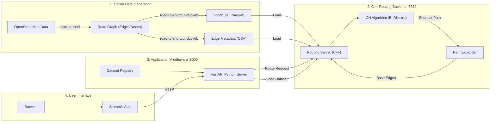

# Architecture Overview

This project is a high-performance **Contraction Hierarchy (CH)** routing engine designed for efficient pathfinding on large road networks. It consists of three main layers: Data Generation, Routing Engine (C++), and Application Layer (Python/UI).



## Component Breakdown

### 1. Offline Data Generation
Before the server starts, we process raw map data into a format optimized for routing.
*   **osm-to-road**: Converts OpenStreetMap XML/PBF into a clean road graph (edges and nodes).
*   **road-to-shortcut-duckdb**: The "Brain". Uses DuckDB (and previously Spark) to pre-calculate **shortcuts**.
    *   Uses **Contraction Hierarchies** to add "shortcut edges" that skip over less important nodes.
    *   Output: `shortcuts.parquet` (compressed graph) and `edges.csv` (metadata).

### 2. C++ Routing Backend (Port 8082)
The heavy lifter. A high-performance C++ server.
*   **Efficiency**: Written in C++ for raw speed and memory efficiency.
*   **The Algorithm**: Runs **Bidirectional Dijkstra** on the shortcut graph.
    *   Uses **H3 Spatial Pruning** to limit the search space (only looking at relevant hexagonal cells).
    *   **Expand Path**: Converts the abstract "shortcut path" (e.g., A -> D) back into the actual road segments (A -> B -> C -> D).
*   **API**: Exposes raw endpoints like `/route_by_edge` and `/health`.

### 3. Application Middleware (Port 8000)
A Python FastAPI wrapper that acts as the controller.
*   **Coordination**: Manages configuration (`datasets.yaml`) and available datasets.
*   **Translation**: Converts user inputs (Lat/Lon coordinates) into Graph Edge IDs.
*   **Safety**: Validates requests before sending them to the C++ engine.
*   **SDK**: Provides a Python interface (`CHQueryEngine`) to interact with the C++ backend.

### 4. User Interface (Streamlit)
The visual frontend for interacting with the engine.
*   **Visualization**: Renders the map, routes, and debug info (H3 cells) using Leaflet.
*   **Interactivity**: Allows clicking the map to set start/end points.
*   **Comparison**: Can compare different routing modes (e.g., Classic vs. Pruned).

## Data Flow: A Routing Request

1.  **User** clicks two points on the Streamlit map.
2.  **Streamlit** sends `start_lat/lon` and `end_lat/lon` to the **Python Middleware (:8000)**.
3.  **Python Middleware**:
    *   Finds the nearest road edge to each coordinate.
    *   Sends a request to the **C++ Backend (:8082)**: *"Find route from Edge 100 to Edge 200"*.
4.  **C++ Backend**:
    *   Runs Bi-directional Dijkstra.
    *   Finds a path of shortcuts.
    *   **Expands** the path (recursively resolving `via_edge`s) to get the full list of road edges.
    *   Returns the geometry (GeoJSON) and stats.
5.  **Streamlit** draws the blue line on the map.

## Deep Dive: The C++ Query Lifecycle

When the C++ Backend receives a `/route` request, here is exactly what happens:

### 1. Request Parsing
The **Crow** web server parses the JSON body:
```json
{
  "start_lat": 37.09, "start_lng": -84.60,
  "end_lat": 37.10,   "end_lng": -84.59,
  "algorithm": "pruned"
}
```

### 2. Nearest Edge Lookup (Spatial Index)
We can't route on coordinates directly. We need Graph Edge IDs.
*   **Input**: `(37.09, -84.60)`
*   **Action**: Queries the **H3/R-tree Spatial Index**.
*   **Result**: Finds the nearest road edge, e.g., `Edge ID: 1593`.
*   *(Repeated for target location)*

### 3. The Core Routing Algorithm (Bi-Dijkstra)
Now we run the **Contraction Hierarchy query** on the *Shortcut Graph*.
*   **Function**: `query_pruned(source=1593, target=4835)`
*   **Process**:
    *   **Forward Search**: Explore outgoing shortcuts from source (only `inside=+1` upward edges).
    *   **Backward Search**: Explore incoming shortcuts from target (only `inside=-1` downward edges).
    *   **Pruning**: Skip any nodes that are geometrically outside the "High Cell" (lowest common ancestor H3 cell).
*   **Result**: A list of **Shortcut IDs**.
    *   Example: `[1593, 34486, 24508, 4835]`
    *   *Note: These are "super-edges" that might span kilometers.*

### 4. Path Expansion (The "Jagged Path" Fix)
We need to convert those shortcuts back into real road edges for the map.
*   **Function**: `expand_path(shortcut_path)`
*   **Logic**:
    *   For each shortcut pair `(u, v)`:
    *   Look up `via_edge`.
    *   If `via_edge == v`: It's a base edge. Keep it.
    *   If `via_edge != v`: It's a composite. Recursively expand `(u, via)` and `(via, v)`.
*   **Result**: A list of **Base Edge IDs**.
    *   Example: `[1593, 1594, 1595, ..., 4835]`

### 5. Response Construction
*   **Geometry**: Look up the LineString geometry for each base edge.
*   **GeoJSON**: Assemble into a single `LineString` Feature.
*   **Stats**: Sum lengths and costs.
*   **Return**: Send JSON back to Python.

## Design Decision: HTTP Microservice vs FFI

You might wonder: *Why not use FFI (like pybind11) to call C++ directly from Python?*

We chose the **HTTP Microservice** pattern for high availability and robustness:

| Feature | HTTP Microservice (Current) | FFI (pybind11 / ctypes) |
| :--- | :--- | :--- |
| **Stability** | ✅ **Robust**. If C++ crashes (segfault), the Python web server survives and returns "503 Error". | ❌ **Fragile**. A singe C++ crash kills the entire Python process. |
| **Concurrency** | ✅ **True Parallelism**. C++ runs in a separate process, ignoring Python's GIL. Can utilize all cores. | ❌ **GIL Limited**. Python calls block until C++ returns, potentially freezing the web server unless carefully managed. |
| **Decoupling** | ✅ **Language Agnostic**. Frontend can be rewritten in Node.js/Go/Rust without touching the backend. | ❌ **Tightly Coupled**. Hard dependency on Python C-API versions. |
| **Use Case** | Best for **API Servers** and Web Apps. | Best for **Data Science Batch Processing** (zero-copy need). |

## Performance & Scalability

Is this architecture "fast enough" for high-load production? **Yes.**

### Why it scales:
1.  **C++ Thread Pool**: The backend (`Crow`) is multithreaded. It utilizes all available CPU cores to process routing requests in parallel.
2.  **No GIL**: Unlike Python, the C++ engine doesn't have a Global Interpreter Lock. It performs true parallel computation.
3.  **Low Latency Algorithm**: The Contraction Hierarchy algorithm relies on pre-computation. Runtime is microseconds to milliseconds, not seconds.
4.  **Horizontally Scalable**: The C++ server is stateless (once loaded). You can run 10 instances behind a Load Balancer (Nginx/AWS ALB) to handle millions of requests.

### Bottlenecks & Optimizations:
*   **JSON Overhead**: For extremely high usage (>10,000 req/sec), parsing JSON becomes expensive.
    *   *Optimization*: Use **gRPC** or **FlatBuffers** instead of JSON.
*   **Network Hop**: Python → C++ adds extreme micro-latency (~0.5ms).
    *   *Optimization*: Use **Keep-Alive** (HTTP Persistent Connections) to reuse TCP sockets.
*   **Python Blocking**: The current Python middleware uses `requests` (blocking).
    *   *Optimization*: Use `aiohttp` or run requests in a thread pool to avoid blocking the Python event loop under load.


