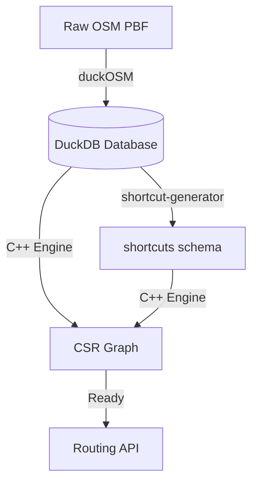

# Data Processing Workflow

The H3 Routing Platform includes a robust pipeline for converting raw OpenStreetMap (OSM) data into the optimized format required by the C++ engine.

## 1. Map Data Ingestion (duckOSM)

The process begins by extracting road network data from OSM PBF files using **duckOSM**.

```bash
cd tools/duckOSM
python main.py --config config/metro_vancouver.yaml
```

- **Output**: DuckDB database with road graph (edges, nodes, edge_graph) per mode
- **Schemas**: `driving`, `walking`, `cycling`
- **Attributes**: Edge properties like `highway`, `maxspeed_kmh`, `cost_s`, and H3 cells

## 2. Contraction Hierarchy Generation

Once the base graph is ready, run the shortcut generation process.

```bash
cd tools/shortcut-generator
python main.py --config config/metro_vancouver_duckdb.yaml
```

- **Input**: DuckDB database from duckOSM (`input_schema: "driving"`)
- **H3 Enrichment**: Every shortcut is assigned an H3 cell and resolution
- **Output**: `shortcuts` schema added to the same DuckDB database

## 3. Deployment to Engine

The generated data is loaded into the **Routing Engine**.

```bash
# Start the C++ engine
make run-engine

# Engine loads datasets from config/datasets.yaml
```

- **Registration**: Datasets defined in `datasets.yaml` or loaded via API
- **Memory Optimization**: CSR format with 78% memory reduction
- **Validation**: Internal consistency check on `via_edge` pointers

---

### Workflow Diagram


